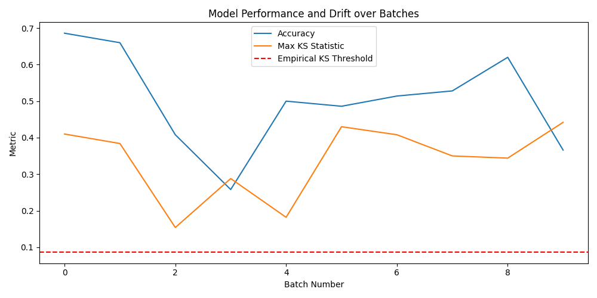

# Model Monitoring Report

## Summary

- Total batches: 10
- Empirical KS threshold (α=0.05): 0.090
- Drift detected in batches: [1, 2, 3, 4, 5, 6, 7, 8, 9, 10]

## Metrics

- Accuracy range: 0.356 – 0.808
- KS statistic max range: 0.172 – 0.442

## Alerts

Drift alerts were triggered in batches: [1, 2, 3, 4, 5, 6, 7, 8, 9, 10].

## Plots

## Details

All feature-level drift statistics stored in `audit_log.db` for full academic audit trails.
